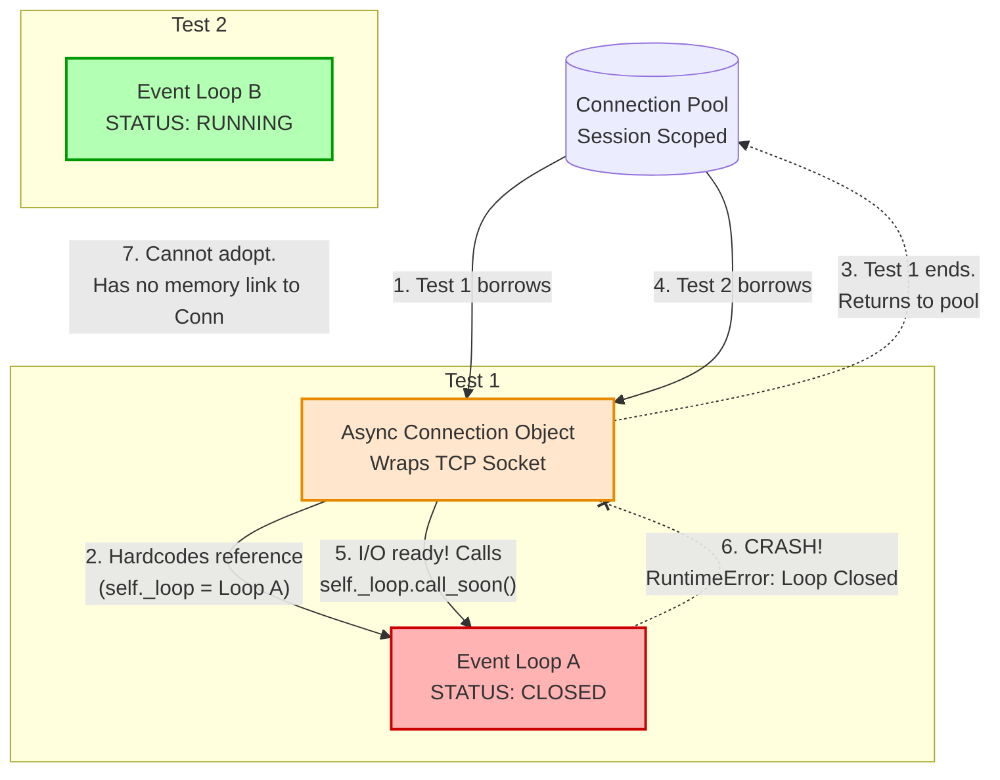

## Asyncio Connection Pool vs. Event Loop Scope Mismatch

**The Core Concept:**
Database connections are not just raw OS sockets; they are wrapped in Python objects (`Transports` and `Protocols`). These objects hold a **hardcoded memory reference** to the specific event loop that created them. When that loop closes, the connection becomes a broken orphan. A new loop cannot adopt it.

### 1. OS-Level Binding (The Multiplexer)

* **Creation:** When an async database engine opens a connection, the OS creates a TCP socket (a File Descriptor, or FD).
* **Registration:** The active event loop registers this FD with its specific I/O multiplexer (`epoll` on Linux, `kqueue` on macOS).
* **Isolation:** When a new test starts, it creates a brand new event loop with a *new* `epoll` instance. It has zero knowledge of the FDs registered to the old, destroyed `epoll`.

### 2. Framework-Level Binding (The Memory Pointer)

* **The Hardcoded Reference:** The `asyncio.Transport` object managing the connection explicitly saves a pointer to its creator loop (e.g., `self._loop = active_loop`).
* **The Callback:** When network I/O is ready, the connection attempts to wake up your async code by scheduling a callback: `self._loop.call_soon()`.
* **The Crash:** If this connection is pulled from a persistent pool by a *new* test, it still points to the old loop. Calling `.call_soon()` on a closed loop immediately throws `RuntimeError: Event loop is closed`.

---

### Architecture Breakdown

---

### Revision: How to Fix (Two Approaches)

1. **Share the Loop (Optimized for Speed)**
* **Action:** Override testing fixtures (like in `pytest-asyncio`) to make the event loop `scope="session"`.
* **Result:** The entire test suite uses one Engine, one Pool, and one Event Loop. No orphans are ever created.

2. **Recreate the Pool (Optimized for Isolation)**
* **Action:** Keep the event loop isolated per test, but make the Engine/Pool fixture `scope="function"`.
* **Result:** Every test gets a fresh loop *and* a fresh Engine. The pool is safely destroyed (`await engine.dispose()`) before the loop closes. *(Note: You can also use `poolclass=NullPool` in SQLAlchemy to prevent connections from being held in memory after the test).*