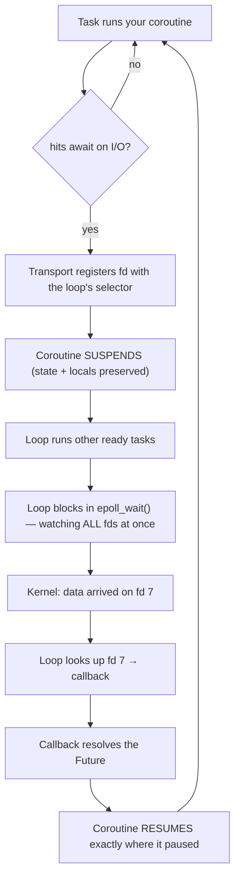

# 03 · Python Concurrency & Async

> ⭐ **The one idea:** A **coroutine** is a function that can pause and resume with its state intact. **`await` is the only switch point** — tasks yield *voluntarily* (cooperative), unlike Java threads which the OS preempts *anywhere*. One thread serves thousands of connections because it's never idle waiting.

---

## 1. Concurrency vs parallelism

| | Concurrency | Parallelism |
|---|---|---|
| What | *dealing with* many things by **switching** | *doing* many things **simultaneously** |
| At any instant | **one** thing runs | **many** things run |
| Needs | 1 core is enough | **multiple cores** |
| Analogy | **one chef** juggling 3 dishes | **three chefs**, all cooking |

Event loop = **concurrency**. Multiple cores running code = **parallelism**.

## 2. Sync vs async

**Sync:** hits something slow → **blocks**; the thread sits idle until the result arrives. 100 concurrent requests ≈ 100 mostly-idle threads (~1MB stack each).

**Async:** hits something slow → **yields control**; the thread runs other work meanwhile.

```python
result = db.query(...)          # sync: thread STOPS, doing nothing
result = await db.execute(...)  # async: yields; loop runs other tasks
```

## 3. Coroutines

**A coroutine is a function that can pause mid-execution and resume later, preserving its position and local variables.** Built on **generator** machinery.

⚠️ **Calling an `async def` does NOT run it** — it returns a *coroutine object* (a paused computation) that needs a loop to drive it.

```python
async def fetch():
    print("start"); await something(); print("end")

c = fetch()   # nothing prints — just a coroutine object
await c       # NOW it runs
```

## 4. The GIL

**Global Interpreter Lock** — only **one thread executes Python bytecode at a time per process**.

- Threads give **concurrency** (I/O juggling) but **not multi-core CPU parallelism** within one process.
- Multi-core requires **multiple processes** (hence gunicorn).
- The GIL is effectively Python's concurrency memory model — it removes most of the JMM's complexity, and most of its parallelism.

## 5. Servers: the full stack

| Layer | Gives you |
|---|---|
| **uvloop** | a **fast** event loop (Cython over **libuv** — the same C library Node.js uses); ~2–4× faster than default asyncio |
| **uvicorn** | one async worker = **concurrency** within one core |
| **gunicorn** | many worker **processes** (≈1/core) = **true parallelism** across cores, sidestepping the GIL |

**True parallelism** = multiple processes genuinely executing at the same instant on different cores — *not* taking turns.
⚠️ **One Python process ≠ the whole CPU.** 8 cores + 1 process = 7 cores idle. gunicorn fixes that by running 8 processes.

**Net effect:** each worker's loop juggles thousands of connections concurrently × N workers in parallel = tens of thousands of concurrent connections on modest hardware.

## 6. Cooperative vs preemptive (Python vs Java)

| | Python async (cooperative) | Java threads (preemptive) |
|---|---|---|
| Who switches | **your code**, at `await` | the **OS scheduler**, anytime |
| Switch points | explicit, **visible** | invisible, any instruction |
| Switch cost | very cheap (save function state) | expensive (OS context switch) |
| Memory/task | tiny (coroutine object) | ~1MB stack per thread |
| Race conditions | **rare** — switches are visible | common — preemption mid-operation |
| Locks needed | rarely | often (`synchronized`, `volatile`) |
| CPU parallelism | ❌ (GIL → multi-process) | ✅ real multi-core |

**The underrated point:** Java's `count++` isn't atomic (preemption mid-op → lost updates → `AtomicInteger`). In Python async, `count += 1` is **safe if there's no `await` between** — you can *see* every point another task could run.

⚠️ **The footgun:** CPU-heavy work or a **blocking call** inside a coroutine never yields → **the entire loop freezes**, all requests stall. Hence async libraries throughout (`asyncpg` not `psycopg2`).

## 7. The four ecosystems

| | Python+uvloop | Node.js | Go | Java 21 |
|---|---|---|---|---|
| Mechanism | event loop (libuv) | event loop (libuv) | **goroutines** (runtime-scheduled) | **virtual threads** (JVM-scheduled) |
| You write | explicit `async`/`await` | async-by-default | **plain blocking code** | **plain blocking code** |
| Async visible? | yes ("coloured" functions) | yes | **no — runtime hides it** | **no — JVM hides it** |
| Multi-core | ❌ (GIL) | ❌ (workers/cluster) | ✅ built-in | ✅ built-in |
| Thread weight | 1 loop + processes | 1 loop + workers | ~2KB, millions | lightweight |

**Two camps:** *explicit event loop* (Python, Node) vs *invisible lightweight threading* (Go, Java-Loom — write blocking code, get event-loop efficiency **plus** real parallelism, no coloured-function problem). Java 21's virtual threads are explicitly Go's model arriving in the JVM.

**uvloop's role:** makes Python's explicit-loop camp as fast as it can be by sharing Node's engine. It doesn't move Python into the Go/Java camp.

---

## 8. What a connection *actually* is (layers)

```
your code:         await db.execute(...)  /  await redis.get(...)
      ↓
client object:     AsyncSession · Redis client · aio_pika channel   (Python objects)
      ↓
connection pool:   reusable connection objects
      ↓
transport/protocol: asyncio Transport + Protocol (buffers, framing)
      ↓
event loop:        selector (epoll/kqueue) — maps  fd → callback
      ↓
socket / fd:       an integer handle owned by the OS kernel
      ↓
kernel:            the actual TCP connection
```

- **Socket** = an OS endpoint for network communication. The kernel hands your process a **file descriptor (fd)** — just an **integer** indexing a per-process table. In Unix "everything is a file": files, sockets, pipes are all fds.
- The **kernel owns** the TCP connection and its buffers; Python objects hold the fd plus bookkeeping.
- **The loop doesn't own the fd** — it *registers interest* (`epoll_ctl`: "tell me when fd 7 is readable") and keeps an `fd → callback` map in its **selector**.
- The connection object holds a **reference to its loop and transport** → this is where **loop affinity** comes from.

## 9. One I/O cycle



**Key:** `epoll_wait()` is the **one blocking call** in the system — the loop parks there watching thousands of fds, and the kernel wakes it when any is ready. It's **not** busy-polling.

## 10. Loop affinity — the thing that breaks tests

An event loop is **an object**, not a global singleton. `asyncio.run()` **creates** one, runs, then **closes and destroys** it. A process can have many (sequentially, or one per thread).

A connection registers its fd with **whatever loop was running when it was created** and stores a reference to it. Close that loop and:
- the **fd may still be open** (the kernel doesn't care about Python loops), but
- the transport points at a **dead loop** → `Event loop is closed` / asyncpg `InterfaceError`.

> **Rule: async resources are bound to the loop they were created on.** Connections, tasks, futures, locks. → *Create async resources **inside** the loop that will use them*, not at module import time.

| | Production (uvicorn) | Tests (pytest-asyncio) |
|---|---|---|
| Loops | **one**, lives for the process | **one per test** (default `function` scope) |
| Module-global client | fine — same loop throughout | breaks — outlives its loop |
| Pooling | ✅ valuable | ❌ pooled conns cross loops |
| Fix | — | `NullPool` · mock · lifespan+DI |

**Why fresh-loop-per-test is deliberate:** a loop carries state (pending tasks, timers, fd registrations). Sharing leaks it → orphaned tasks firing mid-test, order-dependent failures, "passes alone, fails in the suite." Same principle as `create_all`/`drop_all` for the DB: **isolation**. You *can* widen it (`asyncio_default_fixture_loop_scope = "session"`) — trading isolation for speed.

**Real diagnosis from the project:**

| Resource | Created | Safe in tests? | Why |
|---|---|---|---|
| SQLAlchemy engine | import time, **pooled** | ❌ → `poolclass=NullPool` | pooled conns reused across loops |
| Redis client | import time; **connects lazily** on first command | ❌ | object survives; stale conn reused on next loop |
| RabbitMQ channel | **lazily inside `get_channel()`** + `if _channel is None or is_closed` guard | ✅ *accidentally* | born in the current loop; guard recreates when stale |

Three services, three behaviours — the argument for handling all of them uniformly via lifespan + DI.

## 11. Pool vs client (don't conflate)

- `redis.from_url(...)` = **one client backed by a pool**; the pool opens **many** TCP connections as concurrency demands. You already had pooling.
- **One client per process is correct.** A second pool doesn't add capacity — it fragments it and doubles idle connections (Redis has `maxclients`). Legit reasons for a second: **Pub/Sub** (a subscribed conn can't run normal commands), a different instance, different timeouts.
- **Processes can't share Python objects** → N gunicorn workers = N clients = N pools → **one shared Redis server**.

## 12. Context managers

**Problem:** cleanup must happen even on exceptions (`f.close()` after a raising `f.read()` never runs).

**Protocol:** `__enter__` (setup; returns what `as x` binds) and `__exit__(exc_type, exc_value, tb)` — **always runs**. Return `True` to *suppress* the exception (rare); `False`/`None` propagates it.

**Why `async with` exists:** `__enter__`/`__exit__` are **synchronous — you can't `await` inside them**. But async cleanup genuinely needs to await (closing a socket, returning a conn to an async pool). → `__aenter__`/`__aexit__`.

**`@asynccontextmanager`** turns a generator into one:
```python
@asynccontextmanager
async def get_conn():
    conn = await open_conn()   # ← __aenter__
    try:
        yield conn             # ← the block runs here; bound to `as`
    finally:
        await conn.close()     # ← __aexit__ (finally = runs even on exception)
```

**Already used everywhere in the project:** `async with async_session() as session` (get_db) · `async with message.process()` (consumer ack/requeue) · `async with engine.begin()` (transaction) · pytest fixtures with `yield` · **FastAPI lifespan** (scoped to the app's entire lifetime).

*Java: `try-with-resources` + `AutoCloseable.close()`. Java has **no async variant**, always needs a **class** (no generator shortcut), and `close()` gets no exception info while `__exit__` does.*

---

## 🎤 Interview answers

**"Explain async/await in Python."**
> `async def` defines a coroutine — a function that can suspend and resume with its local state intact. `await` marks the only points where it yields control back to the event loop, which then runs other ready tasks and resumes this one when its I/O completes. It's cooperative: between two awaits your code runs uninterrupted, which makes concurrent code much easier to reason about than preemptive threads — but a blocking call with no await freezes the entire loop.

**"If it's single-threaded, how does it handle thousands of connections?"**
> The loop registers each connection's file descriptor with the OS via epoll and then blocks in a single `epoll_wait` call watching all of them at once. When the kernel signals that any fd is ready, the loop looks up the callback and resumes the corresponding coroutine. It's never idle waiting on one connection, and it isn't polling — one syscall covers thousands of sockets.

**"What is the GIL and how do you work around it?"**
> Only one thread runs Python bytecode per process, so threads give you I/O concurrency but not multi-core CPU parallelism. The workaround is multiple processes — gunicorn running roughly one uvicorn worker per core. So you get concurrency from the event loop within a worker and parallelism across workers. Go and Java 21 get both inside one process, which is the real cost of the GIL.

**"Why did your tests fail with 'event loop is closed'?"**
> Async connections are bound to the loop they were created on — the transport registers the fd with that loop's selector and keeps a reference to it. My Redis client and SQLAlchemy engine were created at import time and pooled, so connections outlived the per-test loops that pytest-asyncio creates for isolation. The fixes were `NullPool` for the engine and mocking Redis; the structural fix is creating those clients in FastAPI's lifespan and injecting them as dependencies.

---

## ✅ Gotcha checklist

- [ ] Calling `async def` doesn't run it — you get a coroutine object
- [ ] `await` is the **only** switch point
- [ ] A blocking call inside a coroutine freezes the whole loop
- [ ] One Python process uses one core (GIL) → gunicorn for parallelism
- [ ] Concurrency ≠ parallelism
- [ ] Async resources are bound to their creating loop
- [ ] fd = an integer owned by the kernel; the loop only registers interest in it
- [ ] One client + one pool per process is correct; N workers = N pools, 1 server
- [ ] `async with` exists because cleanup itself may need to `await`
