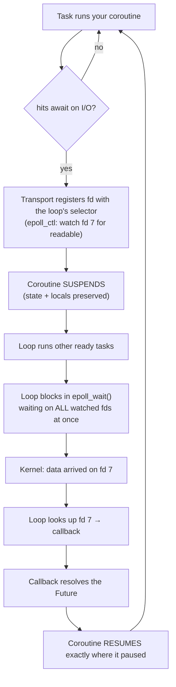

# Python Internals & OOP — Notes
*Curriculum-structured. Python is primary; Java is the contrast. Q&A format keeps the original doubts. Legend: ✅ covered · ⬜ todo (added as we go).*

**Through-line:** Java binds structure & dispatch at compile time (fixed, fast, rigid). Python resolves everything at runtime via dict lookups (flexible, dynamic, dispatch-by-search). Every OOP difference below flows from this.

---

# PART 1 — OOP CONCEPTS (Python primary · Java contrast)

## 1. Object model & attribute access ✅

**Q: What happens on `self.name = "Rex"`?**
It's `self.__dict__['name'] = "Rex"`. An instance is essentially a `dict`; attributes are entries → addable/removable at runtime. *Java: fixed compile-time fields, no runtime addition.*

**Q: Attribute lookup order for `obj.x`?**
data descriptors (class) → instance `__dict__` → class `__dict__` + parents (MRO) → non-data descriptors / class attrs → `__getattr__` / `AttributeError`. This single order explains descriptors, shadowing, and properties.

**Q: Class vs instance attribute — the `a.count += 1` trap?**
Reads the class attribute but **writes an instance attribute** that shadows it → `a` changes, `b`/class don't. Mutable class attrs (shared list) mutated via an instance affect all instances. *Java: `static` makes the distinction explicit.*

**Q: Why do SQLAlchemy columns use no decorators?**
`Mapped[str] = mapped_column(...)` is **annotation + assignment**, backed by descriptors. Decorators transform *functions*; columns declare *typed data attributes*. (Routes use `@app.get` because they wrap functions.)

## 2. Classes, `type` & inheritance mechanics ✅

**Q: Explain `type`.**
Two jobs: `type(x)` = an object's class; and `type` is the **metaclass** — the class that builds classes (`type(Dog)` is `type`). `class` is sugar for `type(name, bases, namespace)`. *Java: compile-time classes, reflection can inspect but not create; no metaclass.*

**Q: Fixed MRO order or do I look it up?**
Deterministic — **C3 linearization** (child before parents; parents in listed order; shared ancestor delayed until after its children; each once). Guarantees a unique order or refuses the class. Confirm via `Class.__mro__`. *Java: single inheritance, no C3 needed.*

**Q: What does `super()` mean?**
"Next class in the MRO", not "my parent" — with multiple inheritance it can call a sibling (cooperative dispatch). *Java: `super` = the one parent.*

## 3. Descriptors & the `@property` family ✅

**Q: What are data descriptors?**
Objects defining `__get__`/`__set__`/`__delete__`, stored as class attributes, intercepting access. **Data** = defines `__set__` (wins over instance `__dict__`). **Non-data** = only `__get__` (loses to instance `__dict__`). Per-instance state lives in `obj.__dict__` (descriptor is shared).

**Q: Descriptors vs Java?**
No equivalent. Java getters/setters weld logic to one field; a descriptor is a *reusable object* attachable to any attribute — only possible via Python's runtime dict-lookup model. `@property`, methods, `classmethod`/`staticmethod`, ORM columns are all descriptors.

**Q: `@property` + `@x.setter` — why write the setter if it "already has" set?**
Getter-only `@property` is **read-only** (assigning raises). `@x.setter` fills the setter slot; a property holds getter/setter/deleter slots, you fill only what you want. Storage uses `_x` to avoid setter recursion. *Java: replaces getter/setter ceremony with attribute syntax.*

**Q: Is a getter-only property data or non-data?**
**Data** — `property` *always defines* `__set__`; with no setter it just raises `AttributeError`. Category = "is `__set__` defined?", not "is it useful?". That's why read-only properties can't be silently shadowed (the `AttributeError` on assignment *is* `__set__` running).

**Q: `@classmethod` vs `@staticmethod`?**
`classmethod` gets `cls` → alternative constructors (`cls(...)` is subclass-correct). `staticmethod` gets nothing → grouped helper needing no state. Normal method gets `self`. *Java: static factory / static method — but Java statics can't be subclass-aware.*

## 4. Encapsulation & access specifiers ✅

**Q: Explain access specifiers, Python vs Java.**
Core difference: **Java enforces access; Python signals it by convention.**

Java — four compiler-enforced levels: `private` (class only), *package-private* (default, same package), `protected` (package + subclasses), `public` (everywhere). `private` is a hard guarantee — outside code *cannot* compile against it. This is why Java uses private fields + public getters/setters.

Python — **no keywords; everything is technically public.** Three convention levels:
- `name` — public, use freely.
- `_name` — "internal, please don't touch" (single underscore). A signal, not a barrier — `obj._x` still works. ≈ Java protected/private *intent*.
- `__name` — **name mangling**: renamed to `_ClassName__name`. Blocks casual access (`obj.__x` → `AttributeError`) but reachable via `obj._ClassName__x`. Its real purpose is avoiding subclass name clashes, not true privacy — a speed bump, not a lock.

Philosophy: Java "the compiler enforces boundaries"; Python "we're all consenting adults here" — it trusts developers and values flexibility (debugging, testing, monkey-patching) over enforced walls. Same *intent* (encapsulation), opposite *means*: Java compiles a wall, Python writes a note.

Mapping: `public`→`name`, `protected`→`_name`, `private`→`__name` (bypassable). In your project, `self._balance` behind a `@property` is exactly the Pythonic "private field + public getter" — signal the raw field `_x`, expose a property.

## 5. Data classes ✅

**Q: What is a `@dataclass`?**
A decorator that **auto-generates** `__init__`, `__repr__`, `__eq__` from annotated fields — kills boilerplate for data-holding classes.
```python
@dataclass
class Point:
    x: int
    y: int
# gives __init__, __repr__ (Point(x=1, y=2)), __eq__ (value equality) for free
```
Options: `frozen=True` (immutable + hashable), `order=True` (adds `__lt__` etc. → sortable). Mutable defaults must use `field(default_factory=list)` (never `tags: list = []` — the shared-mutable trap).

**Q: Dataclass vs Java?**
≈ **Java `record`** (Java 16+) or **Lombok `@Data`**. Java `record` is always immutable → `@dataclass(frozen=True)` ≈ `record`; plain `@dataclass` ≈ mutable data class. Java `record` is a language construct; `@dataclass` is a decorator reading `__annotations__`.

**Q: Dataclass vs Pydantic?**
`@dataclass` = boilerplate reduction, **no runtime type enforcement**. Pydantic `BaseModel` = boilerplate **plus runtime validation** (bad data → error). Rule: `@dataclass` for internal data you control; **Pydantic for external data you must validate** (API bodies, config). Use case in project: a `ClickEvent` dataclass for internal event objects; Pydantic for request/response schemas.

## 6. Abstraction & interfaces ⬜ (todo)
- ABCs — `abc.ABC` + `@abstractmethod`, enforced at instantiation (runtime) · *Java: `abstract class`, compile-time*
- Protocols — `typing.Protocol` (structural typing) vs `ABC` (nominal) · *Java: `interface` (nominal)*
- Duck typing philosophy · *Java: explicit `implements` required*

## 7. Inheritance & polymorphism ⬜ (todo)
- single / multiple / **mixins** · *Java: single class + multiple interfaces + default methods*
- method **overriding** (both) vs **overloading** — Python has *no* true overloading (use default args / `@singledispatch`) · *Java: true signature-based overloading*
- polymorphism: duck-typed vs subtype/interface
- composition vs inheritance (design principle)

## 8. Enums ⬜ (todo)
- `enum` module — `Enum`, `IntEnum`, `StrEnum`, `auto()` · *Java: `enum` is richer — fields, constructors, methods*

## 9. Object contracts & value semantics ⬜ (todo)
- `__eq__` / `__hash__` consistency contract · *Java: `equals()` / `hashCode()` contract*
- immutability — `frozen` dataclass, `tuple`, `namedtuple` · *Java: `final`, `record`*
- copying — `copy` / `deepcopy` · *Java: `clone()` / `Cloneable`*
- `__repr__` vs `__str__` (dev vs user string) 🔸

## 10. Iteration & resource management ⬜ (todo)
- iterators — `__iter__` / `__next__`, `StopIteration` · *Java: `Iterable` / `Iterator`*
- context managers — `__enter__` / `__exit__`, `contextlib` · *Java: try-with-resources / `AutoCloseable`*

## 11. Advanced OOP ⬜ (todo, lower priority)
- generics — `typing.Generic`, `TypeVar` · *Java: generics + type erasure*
- nested / inner classes · *Java: inner, static nested, anonymous*
- metaclasses (deep) — customizing class creation · *Java: none*
- class decorators & `__init_subclass__`
- sealed hierarchies — *Java: `sealed` (17+)*; Python: no direct equivalent
- exceptions as OOP — custom exception classes/hierarchy · *Java: checked vs unchecked (Python has no checked exceptions)*

---

# PART 2 — RUNTIME INTERNALS

## Memory model ✅
No primitives — **everything is a heap object**. Variables are **names bound to objects** (references) → `a = b` aliases, not copies. Freed by **reference counting + cyclic GC** (for reference cycles). Small ints (−5..256) and some strings **interned**. `is` = identity, `==` = value (`__eq__`). *Java: primitives vs objects, stack vs heap, tracing GC, no refcounting.*

## `__slots__` ✅
Removes the per-instance `__dict__`, storing attrs in fixed slots (like Java fields at fixed offsets) → big memory savings + faster access. Only worth it for *many* instances of a simple class. Trade-off: no dynamic attributes.

## Sync vs async & coroutines ✅

**Q: Sync vs async — the core difference?**
**Sync:** hits something slow (DB/network) → **blocks**; the thread sits idle until the result arrives. 100 concurrent requests ≈ 100 mostly-idle threads.
**Async:** hits something slow → **yields control** ("wake me when the data arrives"), so the thread runs *other* work meanwhile. One thread serves hundreds of concurrent operations because it's never idle.

**Q: What is a coroutine?**
**A function that can pause mid-execution and resume later, preserving its position and local variables.** A normal function is all-or-nothing; a coroutine suspends, returns control, and is resumed from that exact point. Built on **generator** machinery (`yield`-based pause/resume).
Key surprise: **calling an `async def` doesn't run it** — it returns a *coroutine object* (a paused computation). It only executes when awaited/driven by an event loop.
```python
c = fetch()   # nothing runs — just a coroutine object
await c       # NOW it runs
```

**Q: If Python async is single-threaded, how does it switch tasks?**
**`await` is the switch point — the only one.** Mechanics: loop runs Task A → A hits `await` on unready I/O → A **suspends itself**, control returns to the loop → loop runs Task B → ... → A's I/O completes (OS notifies via `epoll`/`kqueue`) → loop **resumes A exactly where it paused**.
**Between two `await`s your code runs uninterrupted** — no other task can interleave. This is **cooperative multitasking** (tasks yield voluntarily).
**The footgun:** CPU-heavy work or a *blocking* call inside a coroutine never yields → **the entire event loop freezes** and all requests stall. Hence async libs throughout (`asyncpg` not `psycopg2`).

**Q: Cooperative (Python) vs preemptive (Java threads)?**

| | Python async (cooperative) | Java threads (preemptive) |
|---|---|---|
| Who switches | **your code**, at `await` | the **OS scheduler**, anytime |
| Switch points | explicit, visible | invisible, any instruction |
| Switch cost | very cheap (save function state) | expensive (OS context switch) |
| Memory per task | tiny (coroutine object) | ~1MB stack per thread |
| Race conditions | rare — switches are visible | common — preemption mid-operation |
| Locks needed? | rarely | often (`synchronized`, `volatile`) |
| CPU parallelism | ❌ (GIL → multi-process) | ✅ real multi-core |

**Underrated point:** in Java `count++` isn't atomic (preemption mid-op → lost updates → needs `AtomicInteger`/`synchronized`). In Python async, `count += 1` is safe *if there's no `await` between* — cooperative scheduling makes concurrent code far easier to reason about.
**Trade-off:** async = cheap, safe concurrency but no CPU parallelism; Java threads = real parallelism but heavyweight + hazards. **Java 21 virtual threads** converge on the best of both (cheap + parallel + blocking-style code, no "colored function" problem — in Python, `async` infects the whole call chain).

**In the project:** `await db.execute(...)`, `await redis_client.get(...)`, `await exchange.publish(...)` — each is a point where one uvicorn worker serves *other* requests while waiting.

## GIL & concurrency ✅
**GIL** = only one thread runs Python bytecode at a time per process → threads give concurrency (I/O), not multi-core CPU parallelism within one process. **Concurrency** = one worker switching between tasks (event loop). **Parallelism** = multiple workers on different cores simultaneously (needs multiple processes). *Java: real parallel threads + JMM.*

## Event loops, sockets & connection affinity ✅ (deep dive)

### What a connection actually *is* (layers)

A "database connection" is a stack of wrappers over one OS resource:

```
your code:        await db.execute(...) / await redis.get(...)
      ↓
client object:    AsyncSession / Redis client / aio_pika channel   (Python objects)
      ↓
connection pool:  reusable connection objects (SQLAlchemy pool, redis-py pool)
      ↓
transport/protocol: asyncio Transport + Protocol (buffers, framing)
      ↓
event loop:       selector (epoll/kqueue) — maps fd → callback
      ↓
socket / fd:      an integer handle owned by the OS kernel
      ↓
kernel:           TCP connection to 127.0.0.1:5432
```

- **Socket** = an OS endpoint for network communication. The kernel gives your process a **file descriptor (fd)** — just an integer (3, 7, 12…) that indexes a per-process table of open resources. In Unix, "everything is a file": files, sockets, and pipes are all fds.
- The **kernel** owns the TCP connection and its buffers. Your Python objects only hold the fd plus bookkeeping.
- **The event loop doesn't own the fd** — it *registers interest* in it with the OS (`epoll_ctl` on Linux) saying "tell me when fd 7 is readable." It keeps a map `fd → callback` in its **selector**.
- The connection object holds a **reference to its loop and transport**, which is where loop affinity comes from.

### How the loop drives I/O (one cycle)



Key point: `epoll_wait()` is the **one blocking call** in the whole system — the loop blocks there watching *thousands* of fds simultaneously, and the kernel wakes it when any becomes ready. That's how one thread serves many connections: it's not polling in a busy loop, it's parked in a single syscall until the OS says something is ready.

### Loop affinity — why connections break across loops

An event loop is **an object**, not a global singleton. `asyncio.run()` creates one, runs, then **closes and destroys** it. Multiple loops can exist in one process (sequentially, or one per thread).

When a connection is created, its transport registers its fd with **whatever loop is running at that moment** and stores a reference to it. If that loop is later closed:

- the **fd may still be open** (the kernel doesn't care about Python's loops), but
- the connection's transport points at a **dead loop**, so any call into it raises `Event loop is closed` / asyncpg `InterfaceError`.

**The rule: async resources are bound to the loop they were created on.** Connections, tasks, futures, and locks all carry loop affinity. This is why "create async resources *inside* the loop that will use them" is the guidance — not at module import time.

### Why this bites in tests but not production

| | Production (uvicorn) | Tests (pytest-asyncio) |
|---|---|---|
| Loops | **one**, created at startup, lives for the process | **one per test function** (default scope) |
| Module-level client | fine — same loop all along | breaks — outlives its loop |
| Pooling | ✅ valuable (avoids TCP+auth per request) | ❌ pooled conns cross loops |
| Right config | pooled client | `NullPool` / fresh per use / mock |

**Why a fresh loop per test is deliberate, not a bug:** a loop carries state (pending tasks, timers, callbacks, fd registrations). Sharing one across tests leaks that state → orphaned tasks firing mid-test, order-dependent failures, "passes alone, fails in the suite." Fresh loop per test = same principle as `create_all`/`drop_all` for the database: **isolation**. You *can* widen it (`asyncio_default_fixture_loop_scope = "session"`), trading isolation for speed — prefer correctness by default.

### How each service behaved (real diagnosis from the project)

| Resource | Created | Loop-safe in tests? | Why |
|---|---|---|---|
| SQLAlchemy engine | import time, **pooled** | ❌ → fixed with `poolclass=NullPool` | pooled conns reused across loops |
| Redis client | import time (`from_url`) — but **connects lazily on first command** | ❌ | client object survives; stale pooled conn reused on next loop |
| RabbitMQ (`aio_pika`) | **lazily inside `get_channel()`**, guarded by `if _channel is None or _channel.is_closed` | ✅ *accidentally* | created inside the current loop; `is_closed` check recreates it when stale |

The RabbitMQ case is instructive: it survives partly by **implementation luck** (lazy creation + a staleness guard + `connect_robust`'s auto-reconnect), not by design. Three services, three different behaviours — which is the real argument for handling them uniformly via lifespan + DI.

### Pool vs client (don't conflate)

- `redis.from_url(...)` returns **one client backed by a pool** — the pool opens *many* TCP connections as concurrency demands. You already had pooling; DI doesn't change that.
- **One client per process is correct.** A second pool doesn't add capacity, it fragments it and doubles idle connections (Redis has `maxclients`). Legitimate reasons for a second client: Pub/Sub (a subscribed conn can't run normal commands), a different Redis instance, or different timeouts/db.
- **Processes can't share Python objects.** N gunicorn workers = N clients = N pools → **one shared Redis server**. Same for the SQLAlchemy engine and Postgres.

### Shared state vs per-process state (system-design tie-in)

**Where the state physically lives determines whether it's shared.**

| Stored in | Scope | Examples |
|---|---|---|
| Python variable / `app.state` | **per worker process** | connection clients, loaded ML models |
| Redis / Postgres | **shared across all workers/servers** | rate-limit counters, cache entries, sessions, rows |

Your rate limiter is correct because `INCR ratelimit:user:5` and its TTL live **in Redis**, not in Python. Load balancers distribute **per request** (not per user), so one user's sequential requests land on different workers — all incrementing the same key. An in-process `dict` counter would allow limit × N workers (the classic broken rate-limiter bug, and a real statelessness violation).

**`INCR` is atomic** (Redis is single-threaded, commands run one at a time), so concurrent increments can't lose updates — no locking needed. *Caveat:* `INCR` then `EXPIRE` are two commands; a crash between them leaves a key with no TTL. Bulletproof version = a Lua script or pipeline making both atomic.

### `app.state`

A plain namespace object on the FastAPI app for **application-lifetime** resources. Set it in **lifespan** (so it's created inside the running loop and closed on shutdown), read it via `request.app.state.x`, and expose it through a dependency so it's overridable in tests.

```python
@asynccontextmanager
async def lifespan(app: FastAPI):
    app.state.redis = redis.from_url(settings.redis_url)   # startup — inside the loop
    yield                                                   # ← the whole app runs here
    await app.state.redis.aclose()                          # shutdown — clean close
```

Caveats: **untyped** (typos fail at runtime), **process-local** (never put shared state here), and **not for per-request data** (use `request.state` — app.state = app lifetime, request.state = one request). *Java: ≈ Spring application context singletons with `@PostConstruct`/`@PreDestroy`.*

## Context managers (`with` / `async with`) ✅

**Problem:** cleanup must happen even on exceptions. `f.close()` after a raising `f.read()` never runs. `try/finally` works but is verbose and forgettable.

**Protocol:** `__enter__` (setup, returns what `as x` binds) and `__exit__(exc_type, exc_value, tb)` — **always runs**, success or exception. Return `True` from `__exit__` to *suppress* the exception (rare); `False`/`None` lets it propagate.

**Why `async with` exists:** `__enter__`/`__exit__` are **synchronous — you can't `await` inside them**. But async cleanup genuinely needs to await (closing a socket, returning a conn to an async pool). Hence `__aenter__`/`__aexit__` and `async with`.

**`@asynccontextmanager`** turns a generator into one — the mapping is direct:
```python
@asynccontextmanager
async def get_conn():
    conn = await open_conn()   # ← __aenter__
    try:
        yield conn             # ← the `with` block runs here; value bound to `as`
    finally:
        await conn.close()     # ← __aexit__ (finally = runs even on exception)
```

**Where it already appears in the project:** `async with async_session() as session` (get_db) · `async with message.process()` (consumer ack/requeue) · `async with engine.begin() as conn` (transaction: commit or rollback) · pytest fixtures with `yield` · **FastAPI lifespan** (a context manager scoped to the app's entire lifetime).

*Java: `try-with-resources` + `AutoCloseable.close()`. Differences: Java has **no async variant** (blocking close is fine with threads), always needs a **class** (no generator shortcut), and `close()` gets no exception info while `__exit__` does.*

## Event loop / uvloop ✅
Single thread starts many I/O ops and parks whichever is *waiting* (`await`), resuming when ready — non-blocking I/O. **uvloop** = Cython/libuv event loop (the engine Node uses) → ~2–4× faster than default asyncio. Camps: explicit event loop (Python-async, Node) vs runtime-hidden lightweight threads (Go goroutines, Java virtual threads — true multi-core built in).

## Bytecode / `__pycache__` ✅
Imported modules compile to **bytecode** (`.pyc`) cached here, so imports skip recompiling. Version-tagged (`cpython-312`). Generated artifact → gitignore, never edit, safe to delete. ≈ Java `.class` files.

## Language features ⬜ (todo)
- decorators under the hood (closures, functions returning functions, `functools.wraps`)
- closures & scoping (LEGB, `nonlocal`/`global`)
- generators & `yield` (lazy evaluation)
- comprehensions (list/dict/set)
- `*args` / `**kwargs`, keyword-only args, unpacking
- exception model — EAFP vs LBYL, `try/except/else/finally` · *Java: checked exceptions*
- type hints / `typing` — `Optional`, `|`, `Literal`, `Generic`, `Protocol`, `Annotated`
- `functools` (`lru_cache`, `partial`, `wraps`, `singledispatch`), `itertools`
- collections — `Counter`, `defaultdict`, `deque`, `namedtuple`, `heapq`, `bisect` (≈ Java Collections)
- modules, packages, imports (`__init__.py`, absolute vs relative)
- concurrency hands-on — `threading`, `multiprocessing`, `asyncio`, `concurrent.futures`

---

# TOOLING ✅

**Q: uv vs pip; Python version?**
pip installs packages; **uv** (Rust) also manages venvs, Python versions, lockfiles — 10–100× faster (`uv add`, `uv run`). Use **Python 3.12** (widest lib compatibility); 3.14 too new (library lag). *Java prod pins LTS (21); Python has ~5-yr support windows, no formal LTS.*

**Q: `__pycache__`?** — see Bytecode above.

---

*Documentation principle: every concept ends as "Python: <impl> · Java: <contrast>". This file is the growing OOP-in-both-languages reference; ⬜ items get filled as we cover them.*